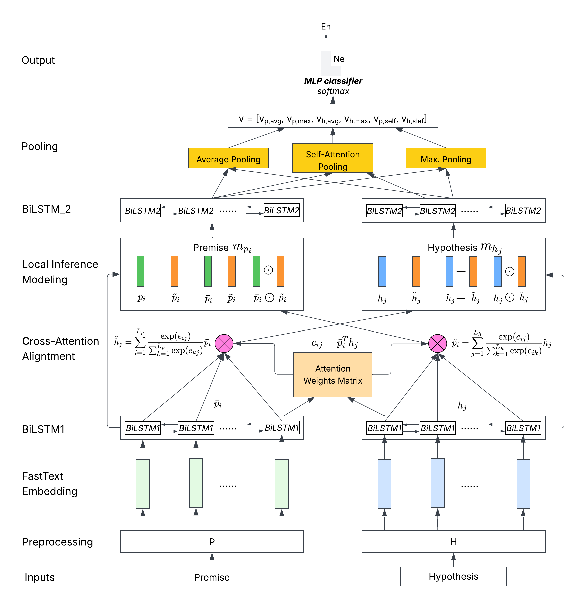

# Natural Language Inference with Deep Learning

This project explores Natural Language Inference (NLI) using multiple deep learning architectures, with a focus on how explicit interaction and attention mechanisms affect reasoning performance.

We implement and compare several neural models on a textual entailment dataset, including Bi-LSTM, ESIM, and a Transformer-based encoder, supported by quantitative evaluation and qualitative attention analysis.

## Project Overview

The project focuses on:
- Neural architectures for textual entailment
- Model comparison under a unified experimental setup
- Explicit interaction modeling using attention
- Ablation studies on attention and interaction components
- Qualitative interpretation via attention visualisation

## Models Implemented

- **Bi-directional LSTM (Bi-LSTM)** – baseline sequence model
- **ESIM (Enhanced Sequential Inference Model)**  
  - Cross-attention alignment  
  - Interaction features (difference & element-wise product)  
  - Inference composition with pooling
- **Transformer-based Encoder**
  - Self-attention with feature fusion
  - Sentence-level representation learning

**ESIM Architecture**  

## Experimental Results

- ESIM achieves the best test accuracy (~80%), outperforming Bi-LSTM and Transformer baselines
- Explicit cross-attention consistently improves generalisation
- Ablation studies show interaction features are critical for reasoning
- Transformer encoder shows higher architectural complexity but weaker performance under limited data

## Interpretability Analysis

Attention weights are visualised to analyse model reasoning behaviour:
- Correct predictions show meaningful token alignment
- Misclassified examples reveal over-localised attention
- Visualisation helps explain reasoning failures in complex cases

## Academic Context

This work was completed as a group project for  
**CITS4012 – Natural Language Processing**, University of Western Australia.

**Contributors**
- Boya Zhang  
- Bassiman Bin Anuar  
- Justin Lu  

## Technologies

PyTorch · Deep Learning · NLP · Attention Mechanisms · LSTM · Transformer